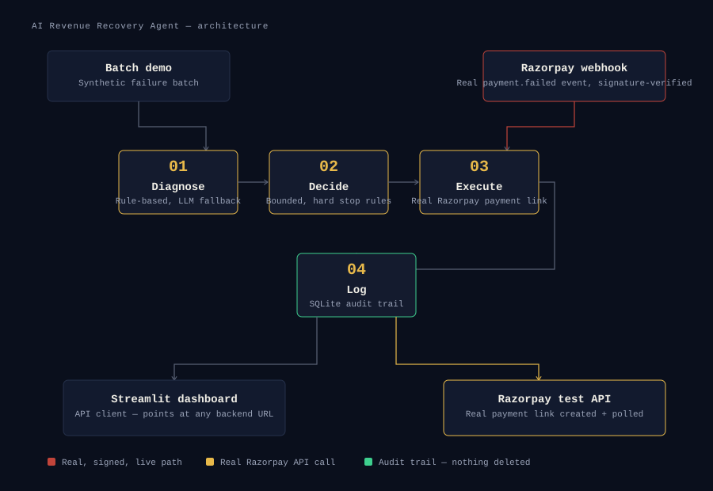

# AI Revenue Recovery Agent

Built for the Razorpay AI Buildathon — **Track 03: AI Revenue Recovery**.

**Live:**
- Dashboard: https://revenue-recovery-dashboard.onrender.com
- Backend API: https://revenue-recovery-agent-36nl.onrender.com
- Source: https://github.com/gourikam/revenue-recovery-agent

Diagnoses why a subscription/payment failed, decides a single bounded
intervention (retry / payment link / Hinglish reminder / escalate), executes
it, and logs every step to an audit trail — then reports honest recovery
metrics on a batch, including the cases it could **not** resolve.

## Why this exists

Revenue loss rarely happens in one clean step — a payment degrades, a
subscription fails, a customer just needs a nudge. This agent closes the
loop: detect → diagnose → decide → act → measure, with hard stopping rules
so it never blindly retries a fraud-flagged card or retries forever.

## Architecture



**File map:**
- `synthetic_data.py` — generates a batch of realistic failed-payment events
- `diagnosis.py` — rule-based root-cause classification, LLM fallback via Groq
- `decision.py` — bounded decision logic with hard stopping rules
- `messaging.py` — Hinglish reminder / payment-link message generation
- `voice.py` — real text-to-speech synthesis of the Hinglish reminder
- `razorpay_client.py` — real Razorpay API calls (payment links, webhook verification)
- `recovery_engine.py` — orchestrates the full pipeline
- `db.py` — SQLite audit trail
- `app/main.py` — FastAPI backend, including the real-time `/webhook/razorpay` endpoint
- `dashboard.py` — Streamlit dashboard, a pure API client of the backend

## Two extra recovery capabilities

**Hinglish voice reminders.** Every `send_hinglish_reminder` action also
generates a real spoken audio file (via gTTS) of the message, playable
directly in the dashboard's case detail view. Honest limitation: gTTS reads
Roman-script Hinglish with Hindi phonetics, which is understandable but not
native-quality — a production system would use a proper Indian-language TTS
provider (Bhashini, ElevenLabs, or similar) for better pronunciation. This is
real generated audio, not a mockup — just not production-polish quality.

**Mandate-aware retry scheduling.** For failures on a subscription-linked
payment (a `subscription_id` is present, meaning it's a recurring UPI
Autopay / e-mandate charge, not a one-off card payment), a transient gateway
failure doesn't get retried instantly. Instead the agent computes a spaced
retry date (illustrative schedule: +1, +3, +5 days), since instantly
re-attempting a failed mandate debit isn't how real recurring payments work
in practice. Non-mandate, one-off payments still retry immediately as
before — this logic only activates when `subscription_id` is present.

## Hard stopping rules (the safety bar)

1. **Never retry a card flagged as lost/stolen/fraud** — hard compliance
   stop, always escalates to human, 0% auto-recovery attempted.
2. **Max 3 retries** — after that, automatically escalates instead of
   retrying forever.
3. **Low-confidence diagnosis → human**, never a guessed money action.

Every decision returns a human-readable `reason` — nothing happens silently.

## Real-time mode (webhook) vs demo mode (batch)

The agent has two entry points into the same pipeline:

- **`POST /run-batch`** (or the dashboard's "Run new batch" button) — generates
  a synthetic batch and processes it. This is the reliable, always-works demo
  path — use this for your pitch video.
- **`POST /webhook/razorpay`** — a real-time endpoint that receives Razorpay's
  actual `payment.failed` webhook the moment a payment fails, verifies its
  signature, and runs it through the identical diagnose → decide → execute →
  log pipeline. No polling, no manual batch trigger.

To wire up the real webhook:
1. In Razorpay Dashboard → Settings → Webhooks, create a webhook subscribed to
   `payment.failed`, and copy the secret it generates into `.env` as
   `RAZORPAY_WEBHOOK_SECRET`.
2. Razorpay can't reach `localhost`, so expose your local FastAPI server
   during development: `ngrok http 8000`, then set the webhook URL in the
   Razorpay dashboard to `https://<your-ngrok-id>.ngrok.io/webhook/razorpay`.
3. Trigger a real test-mode payment failure (e.g. using a
   [Razorpay test card](https://razorpay.com/docs/payments/payments/test-card-upi-details/)
   designed to fail) and watch the case appear in your dashboard automatically.

Every webhook-sourced case is tagged `source: webhook` in the audit trail and
counted separately in the dashboard, so it's always clear which cases came
from a real event versus the demo batch.

## Running it

```bash
pip install -r requirements.txt
cp .env.example .env   # optional — works with zero API keys via rule-based fallback

# Option A: Streamlit dashboard (recommended for the demo)
streamlit run dashboard.py

# Option B: FastAPI backend
uvicorn app.main:app --reload
# then: POST /run-batch, GET /metrics, GET /cases/{id}/audit
```

No API keys are required to run this end to end — `diagnosis.py` and
`messaging.py` both fall back to rule-based logic / templates if
`GROQ_API_KEY` isn't set, and `recovery_engine.py` simulates Razorpay
test-mode outcomes so you can demo without live keys.

## Results on a synthetic 75-case batch

- **51.4% recovery rate** (₹1,11,852 of ₹2,17,669 at-risk recovered)
- **22 cases correctly hard-stopped** (fraud-flagged cards) — 0 recovery
  attempted on any of them, as required
- **25 cases** genuinely failed retry and are shown in the honest exception
  list, not hidden

## What's simulated vs real

- **Webhook-sourced cases (real Razorpay `payment.failed` events):** the
  agent attempts a real Razorpay test-mode Payment Link via the API. Click
  **"Check real payment links"** in the dashboard to poll Razorpay and see
  if a link was actually paid (use a
  [Razorpay test card](https://razorpay.com/docs/payments/payments/test-card-upi-details/)
  to complete one for a live demo).
- **Batch-sourced cases (the demo button):** simulated by design, not by
  fallback. Firing 20+ real payment-link creation calls in rapid succession
  reliably trips Razorpay's test-mode rate limit ("Too many requests"),
  which would silently degrade an entire batch to simulation anyway and
  make the batch demo unreliable. Rather than fight an undocumented
  rate-limit ceiling, batch runs are simulated on purpose — they exist to
  demonstrate measured recovery metrics at scale with a consistent,
  honest methodology. The real, end-to-end proof (real diagnosis → real
  decision → real payment link → real customer payment) comes from the
  webhook path instead, one case at a time, where there's no burst risk.
- Note on design: Razorpay (like all card networks, per RBI rules) doesn't
  allow silently re-charging a saved card without a pre-authorized
  recurring mandate — so "retry" here realistically means generating a
  fresh, real payment link rather than a hidden auto-charge. This is a
  deliberate, honest choice, not a shortcut.
- Diagnosis, decision logic, stopping rules, and the audit trail are 100%
  real regardless of source or Razorpay configuration.

## Next steps if extending

- Real Razorpay Subscriptions webhook listener instead of synthetic batch
- WhatsApp/SMS gateway integration for actually sending the Hinglish
  reminder
- A/B test which intervention actually recovers more per root-cause
  category